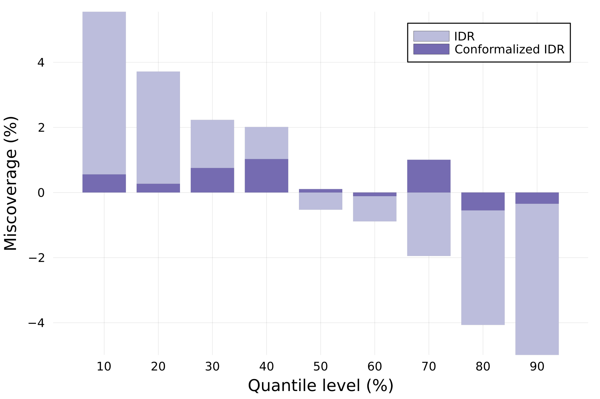

# Examples
Below You can find some simple examples of what can be achieved with `PostForecasts.jl`

## Load and postprocess point forecasts
In the first example we show how to load point forecasts from a delimited file and postprocess them using a selected model in \textit{PostForecasts.jl}. Assume that the file named \textit{my-point-forecasts.csv} has the following structure: 
```csv
timestamp,observation,forecast1,forecast2
0,52.250,53.775,52.215
1,55.005,57.450,53.732
2,58.125,57.728,58.426
```
To load and postprocess it we only need two function calls:
```julia
using PostForecasts
pf = loaddlmdata("my-point-forecasts.csv", delim=',', idcol=1, obscol=2, predcol=[3, 4], colnames=true)
```
First, the `loaddlmdata` function reads the file, where the arguments specify that the file is comma delimited, the identifiers are stored in the first column, the observations in the second, and the predictions in the third and fourth. The last argument informs that the column names are present in the file, so the first row is not parsed into numeric values.
```julia
qf = point2quant(pf, method=:qr, window=100, quantiles=[0.9, 0.95, 0.99])
```
Next, the `point2quant` function postprocesses the forecasts stored in `pf`, computes quantile predictions and stores them in `qf`. In the above snippet, the arguments specify that Quantile Regression Averaging is used for postprocessing, calibration window size is 100 data points, and that the 90th, 95th and 99th percentiles are predicted. By default, the postprocessing model is retrained before every prediction using a calibration window of most recent data points. For details on alternative configurations, see the documentation of the [`point2quant`](postprocess.md#From-point-to-probabilistic-forecasts) function.

Quantile forecasts `qf` are now ready to be [evaluated](evaluation.md#Evaluation-metrics), [averaged](averaging.md#Forecast-Averaging) with other forecasts, [conformalized](postprocess.md#Conformalizing-probabilistic-forecasts) and [saved](loadsave.md#Loading-and-saving-forecasts).

## Probabilistic forecasting of day-ahead electricity prices
Let us now show how to compute probabilistic forecasts of day-ahead electricity prices from point forecasts stored in the [EPEX dataset](datasets.md#EPEX) for all hours of the year 2023, using three different postprocessing schemes - IDR, CP and QRA. See [(Lipiecki et al., 2024)](https://doi.org/10.1016/j.eneco.2024.107934) for more details on this forecasting task.

The snippet below first creates a dictionary that stores 24 `QuantForecasts` for each of the three models, then iterates over the 24 hours of the day, loads the point forecasts, finds the indices corresponding to the first and the last day of 2023, and generates the probabilistic forecasts for 9 deciles (i.e., percentiles 10%, 20%, ..., 90%) using each model. The results are saved in `QuantForecasts`:
```julia
using PostForecasts

methods = [:idr, :cp, :qr]
qf = Dict((m => Vector{QuantForecasts}(undef, 24) for m in methods)...)

for h in 1:24
    pf = loaddata(Symbol(:epex, h))
    for m in methods
        qf[m][h] = point2quant(pf, method=m, window=56, quantiles=9, start=20230101, stop=20231231)
    end
end
```
The probabilistic forecasts can then be combined, e.g. using averaging over probabilities with `paverage`:
```julia
qf[:ave] = Vector{QuantForecasts}(undef, 24)
for h in 1:24
    qf[:ave][h] = paverage([qf[m][h] for m in methods])
end
```
and the CRPS of the individual and the combined predictive distributions can be easily compared:
```
println("Method \t| CRPS ")
println("-"^20)
for m in [methods..., :ave]
    println(uppercase(string(m)), " \t| CRPS: ", round(sum(crps.(qf[m]))/24, digits=3))
end
```
which should generate the following output:
```
Method 	| CRPS 
--------------------
IDR 	| CRPS: 9.752
CP 	    | CRPS: 9.822
QR 	    | CRPS: 9.986
AVE 	| CRPS: 9.248
```
Note that the computations can take some time. While IDR and CP are almost instantaneous, QRA is more time-consuming and can take up to a few minutes.

The script corresponding to this example can be found in `examples/postprocess-epex.jl`.

## Different flavors of quantile regression
There are multiple approaches to applying quantile regression to a pool of point forecasts, here we compare four of them, which can be readily computed using the **PostForecasts.jl** package.

In this example we will postprocess day-ahead electricity price forecasts stored in the [EPEX dataset](datasets.md#EPEX) for hour 20 during the entire year 2021, using a one-year training window:

```
using PostForecasts

pf = loaddata(:epex20)
pf = pf(20200101, 20211231)
qf = Dict()
```

### QRA
**Q**uantile **R**egression **A**veraging - each point forecast is treated as a seperate regressor in a multivariate quantile regression - $\hat{q}_{\tau|\hat{y}^{(1)}, ..., \hat{y}^{(m)}} = \beta^{(\tau)}_0 + \beta^{(\tau)}_1\hat{y}^{(1)} + ... + \beta^{(\tau)}_m\hat{y}^{(m)}$
```julia
qf["QRA"] = point2quant(pf, method=:qr, window=365, quantiles=9)
```

### QRM
**Q**uantile **R**egression **M**achine - point forecasts are averaged and treated as a single regressor in a univariate quantile regression - $\hat{q}_{\tau|\hat{y}^{(1)}, ..., \hat{y}^{(m)}} = \beta^{(\tau)}_0 + \beta^{(\tau)}_1 \frac{1}{m}\sum_{i=1}^m{\hat{y}^{(i)}}$
```julia
qf["QRM"] = point2quant(average(pf), method=:qr, window=365, quantiles=9)
```

### QRF
**Q**uantile **R**egression with probability (**F**) averaging - each point forecast is treated as a regressor of a univariate quantile regression, the output distributions of `m` quantile regressions are averaged over probabilities
```julia
qf["QRF"] = paverage(point2quant.(decouple(pf), method=:qr, window=365, quantiles=9))
```

### QRQ
**Q**uantile **R**egression with **Q**uantile averaging - each point forecast is treated as a regressor of a univariate quantile regression, the output distributions of `m` quantile regressions are averaged over quantiles
```julia
qf["QRQ"] = qaverage(point2quant.(decouple(pf), method=:qr, window=365, quantiles=9))
```

Then we can print the resulting CRPS of the computed forecasts:
```julia
println("Method \t| CRPS ")
println("-"^20)
for m in ["QRA", "QRM", "QRF", "QRQ"]
    println(m, "\t| ", round(crps(qf[m]), digits=3))
end
```
which should yield the following output:
```
Method 	| CRPS 
--------------------
QRA 	| 10.464
QRM 	| 10.229
QRF 	| 10.308
QRQ 	| 10.285
```
The script corresponding to this example can be found in `examples/quantregs.jl`.

## Conformalizing weather forecasts
In this example we show how to conformalize quantile forecasts to improve the coverage of predictive distributions of weather variables from the [PANGU dataset](datasets.md#PANGU) postprocessed using IDR, and visualize the miscoverage, i.e., the difference between nominal and empirical coverage, with respect to the quantile levels, using the Plots package.

We will first load the dataset (select the forecasted variable and the lead time of point predictions) and initialize the plot:
```julia
using PostForecasts

variable = :u10 # u10, c10, t2m, t850 or z500
leadtime = 24 # between 0 and 186, divisible by 6

pf = loaddata("pangu$(leadttime)$(variable)")
plot(xlabel="Quantile level (%)", ylabel="Miscoverage (%)", framestyle=:grid, xticks = 10:10:90)
```
Then, using the `point2quant` function, we compute the quantile forecasts `qf` for 9 deciles using the IDR with a training window of 365 days and plot their miscoverage:
```julia
qf = point2quant(pf, method=:idr, window=365, quantiles=9)
bar!(getprob(qf).*100, (coverage(qf)-getprob(qf)).*100, linewidth=0, color=colorant"#bcbddc", label="IDR") 
```
Next, we proceed to conformalizing `qf` and adding it to the plot:
```julia
conformalize!(qf, window=182)
bar!(getprob(qf).*100, (coverage(qf)-getprob(qf)).*100, linewidth=0, color=colorant"#756bb1", label="Conformalized IDR")
```
Note that we used the in-place method `conformalize!`, which will leave the first 182 unconformalized predictions in `qf`.

The resulting plots shows that the conformalization helped to significantly decrease the miscoverage of IDR predictions, leading to better calibrated quantile forecasts, especially at extreme levels (0.1 and 0.9):


The script corresponding to this example can be found in `examples/conformalize-pangu.jl`.

## Supporting decision making on energy markets
To highlight the significance and utility of probabilsitic forecasts, let us present a short scenario of trading on day-ahead electricity market.

Consider an energy company that owns a battery and trades in the day-ahead market. Every morning it faces the decision about whether to submit a buy order to charge the battery and a sell order to discharge it at a later hour of the next day, or avoid trading due to adverse market conditions.

In this example, we show how probabilistic forecasts can help us identify risky market conditions and prevent losses.

For simplicity, we focus on two weeks in April 2023 and assume that buy orders are submitted for 3am while sell orders for 7pm. The following snippet shows how to postprocess point predictions from the EPEX dataset to obtain decile forecasts using the IDR:
```julia
using PostForecasts, Plots

fsBUY = loaddata(Symbol(:epex, 4))      # buy at 3am
fsSELL = loaddata(Symbol(:epex, 20))    # sell at 7pm

qfBUY = point2quant(fsBUY, method=:idr, window=182, quantiles=9, start=20230408, stop=20230421)
qfSELL = point2quant(fsSELL, method=:idr, window=182, quantiles=9, start=20230408, stop=20230421)
```
From the decile forecasts we can construct four prediction intervals (PI) centered around the median with confidence level of 20%, 40%, 60% and 80%. To visualize the results, we can plot the median price forecasts, the PIs and the observed prices for 3am and 7pm:
```julia
plot(legend=:bottom, xlabel="Days", ylabel="Price (€/MWh)", xticks=1:14, framestyle=:box) 
# plot forecasts of the median price
plot!(viewpred(qfBUY, eachindex(qfBUY), 5), linealpha=0.5, color=3, lw=3, label="Buy price")
plot!(viewpred(qfSELL, eachindex(qfBUY), 5), linealpha=0.5, color=1, lw=3, label="Sell price")
# plot prediction intervals constructed from quantiles forecasts
for i in 1:4
    plot!(viewpred(qfBUY, eachindex(qfBUY), 5-i), lw=0, fillrange=viewpred(qfBUY, eachindex(qfBUY), 5+i), fillalpha=0.1, color=3, label=nothing)
    plot!(viewpred(qfSELL, eachindex(qfBUY), 5-i), lw=0, fillrange=viewpred(qfSELL, eachindex(qfBUY), 5+i), fillalpha=0.1, color=1, label=nothing)    
end
# plot observed prices
plot!(viewobs(qfBUY), color=3, st=:scatter, markerstrokewidth=0, label=nothing)
plot!(viewobs(qfSELL), color=1, st=:scatter, markerstrokewidth=0, label=nothing)
```


Clearly, on the third day the upper quantiles of prices for 3am significantly overlap the lower quantiles of prices for 7pm. This indicates that the buy price is quite likely to be higher than the sell price, so the trading strategy carries substantial risk. Indeed, the actual price at 7pm (red dot) was lower than at 3am (green dot) for that day, so trading would lead to incurring a loss. 

This short example showcases how probabilistic foreecasts can provide us with more information about possible outcomes of our decisions. To read about the strategies for battery-based trading on electricity markets and their economic evaluation, see the contributions of [Nitka and Weron (2023)](https://doi.org/10.48550/arXiv.2308.15443) and [Maciejowska et al. (2023)](https://doi.org/10.48550/arXiv.2303.08565).

The script corresponding to this example can be found in `examples/trading.jl`.
