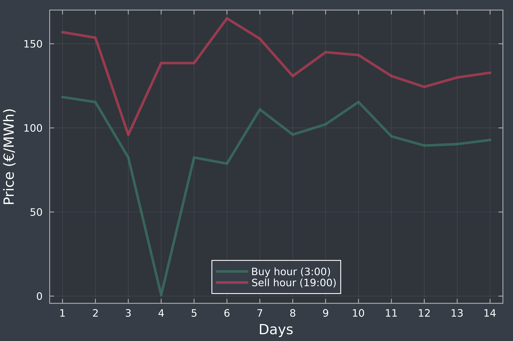
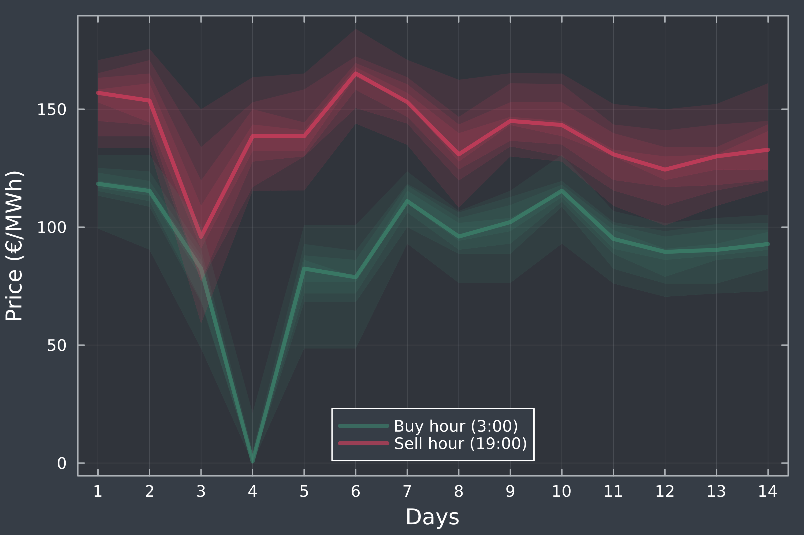

# Examples
Below You can find some simple examples of what can be achieved with `PostForecasts.jl`

## Load and postprocess point forecasts
In this short example we will show how to load Your own point forecasts and postprocess them using a selected model.

First, we will load the package:
```julia
using PostForecasts
```
Then specify the path where the delimitted file with point forecasts is located, for example:
```julia
filepath = "my-data/my-point-forecasts.csv"
```
We can load this file using `loaddlmdata()` function, but we first need to know the structure of the data. For the sake of example we will assume the following scheme of the `my-point-forecasts.csv` file:
```csv
date,observation,forecast1,forecast2
0101,53,55,50
0102,52,54,56
0103,60,58,59
...
```
Now we can load it to the variable `pf` with:
```julia
pf = loaddlmdata(filepath, delim=',', idcol=1, obscol=2, predcol=[3, 4], colnames=true)
```
the arguments specify that the file is delimitted with a comma, the identifiers are stored in the first column, the observations in the second, and the predicitons in the third and fourth one. Additionally, `colnames=true` informs that the column names are present, so the first row will not be parsed into numeric values.

Finally, we can proceed to postprocessing the forecasts and generating predictive distributions. For this we will need to specify the `quantiles` of interest, the length of the training `window`, and the `model`. For example:
```julia
model = :qr
window = 100
quantiles = [0.9, 0.95, 0.99]
```
will calibrate quantile regression on the window of 100 data points to forecast the 90-th, 95-th and 99-th percentile. Running
```julia
qf = point2quant(pf, model, window, quantiles)
```
will generate the series of quantile forecasts `qf` starting from the `window+1`-th point in the series of point forecasts `pf`. By default, the model is retrained before every prediction using the most recent `window` points. To train the model only once, on the first `window` points in the series, you can use the keyword argument `retrain=0`.

Quantile forecasts `qf` are now ready to be [evaluated](evaluation.md#Evaluation-metrics), [averaged](averaging.md#Forecast-Averaging) with other forecasts, [conformalized](postprocess.md#Conformalizing-probabilistic-forecasts) and [saved](loadsave.md#Loading-and-saving-forecasts).

## Electricity price forecasting
This example showcases how to prepare probabilistic forecasts of day-ahead electricity prices for all 24 hours of the day within a full calendar year, using three different models (IDR, CP and QRA). See [(Lipiecki et al., 2024)](https://doi.org/10.1016/j.eneco.2024.107934) for more details on this forecasting task.

First, specify the year (between 2020 and 2023) and the length of the training window (note that the data starts on December 27, 2018). Here we use the year 2021 and a 182-day window.
```julia
using PostForecasts, Statistics

year = 2021
window = 182
models = [:idr, :cp, :qr]
```
Prepare a dictionary for storing pinball loss values for each model and hour.
```julia
losses = Dict((model => zeros(24) for model in models)...)
```
Then, for each hour load the point forecasts to the variable `pf` and find the indices corresponidng to the first and last day of the specified year. Generate the probabilistic forecasts for 9 deciles (`nquantiles = 9`) using each model and save their corresponding mean pinball loss to the dictionary.
```julia
Threads.@threads for hour in 1:24
    pf = loaddata(Symbol(:epex, hour))
    first = findindex(pf, year*10_000 + 0101)
    last = findindex(pf, year*10_000 + 1231)
    nquantiles = 9
    for model in models
        losses[model][hour] = mean(pinball(point2quant(pf, model, window, nquantiles, first=first, last=last)))
    end
end
```
Here, `Threads.@threads` is used to parallelize over available threads. Use `julia --threads=X` to run a Julia instance with `X` threads. Finally, we can proceed to printing the results.
```julia
println("Year: $(year)")
println("Calibration window of $(window) days")
println("-"^30)
println("Model\t| Average Pinball Loss")
println("-"^30)
for model in models
    println(uppercase(string(model)), "\t|", round(mean(losses[model]), digits=3))
end
println("-"^30)
```

This script (`examples/epf.jl`) should yield the following output:
```
Year: 2021
Calibration window of 182 days
------------------------------
Model	| Average Pinball Loss
------------------------------
IDR	|4.831
CP	|4.859
QR	|4.768
------------------------------
```
Note that the computation may take some time. While IDR and CP are almost instantaneous, QRA is more time-consuming and can take several minutes if run on a single thread.

## Different flavors of quantile regression
There are multiple approaches to applying quantile regression to a pool of point forecasts, here we compare four of them, which can be readily computed using the **PostForecasts.jl** package.

First, specify the training window, the number of quantiles to be forecasted and the data to be used for postprocessing:

```
using PostForecasts

year = 2021
window = 182
nquantiles = 9
hour = 15

pf = loaddata(Symbol(:epex, hour))
first = findindex(pf, year*10_000 + 0101)
last = findindex(pf, year*10_000 + 1231)
pf = pf[first-window:last]
```

### QRA
**Q**uantile **R**egression **A**veraging - each point forecast is treated as a seperate regressor in a multivariate quantile regression - $\hat{q}_{\tau|\hat{y}^{(1)}, ..., \hat{y}^{(m)}} = \beta^{(\tau)}_0 + \beta^{(\tau)}_1\hat{y}^{(1)} + ... + \beta^{(\tau)}_m\hat{y}^{(m)}$
```julia
qfQRA = point2quant(pf, :qr, window, nquantiles)
```

### QRM
**Q**uantile **R**egression **M**achine - point forecasts are averaged and treated as a single regressor in a univariate quantile regression - $\hat{q}_{\tau|\hat{y}^{(1)}, ..., \hat{y}^{(m)}} = \beta^{(\tau)}_0 + \beta^{(\tau)}_1 \frac{1}{m}\sum_{i=1}^m{\hat{y}^{(i)}}$
```julia
qfQRM = point2quant(average(pf), :qr, window, nquantiles)
```

### QRF
**Q**uantile **R**egression with probability (**F**) averaging - each point forecast is treated as a regressor of a univariate quantile regression, the output distributions of `m` quantile regressions are averaged over probabilities
```julia
qfQRF = paverage([point2quant(ipf, :qr, window, nquantiles) for ipf in decouple(pf)], nquantiles)
```

### QRQ
**Q**uantile **R**egression with **Q**uantile averaging - each point forecast is treated as a regressor of a univariate quantile regression, the output distributions of `m` quantile regressions are averaged over quantiles
```julia
qfQRQ = qaverage([point2quant(ipf, :qr, window, nquantiles) for ipf in decouple(pf)])
```
Then we can print the results of the computed models.
```julia
println("Year $(year), hour $(hour-1):00")
println("Calibration window of $(window) days")
println("-"^30)
println("Model\t| Average Pinball Loss")
println("-"^30)
println("QRA\t|", round(mean(pinball(qfQRA)), digits=3))
println("QRM\t|", round(mean(pinball(qfQRM)), digits=3))
println("QRF\t|", round(mean(pinball(qfQRQ)), digits=3))
println("QRQ\t|", round(mean(pinball(qfQRF)), digits=3))
println("-"^30)
```
The expected output of this script (`examples/quantregs.jl`):
```
Year 2021, hour 14:00
Calibration window of 182 days
------------------------------
Model	| Average Pinball Loss
------------------------------
QRA	|5.61
QRM	|5.449
QRF	|5.296
QRQ	|5.365
------------------------------
```

## Conformalizing weather forecasts
Specify which weather variable to forecast and at which lead time to use.
```julia
using PostForecasts

variable = :u10 # u10, c10, t2m, t850 or z500
leadtime = 24 # between 0 and 186, divisible by 6

pf = loaddata(Symbol(:pangu, leadtime, variable))
println("$(uppercase(string(variable))) forecasts with lead time of $(leadtime) hours")
```
Compute the quantile forecasts for 9 deciles using IDR with a training window of a single year.
```julia
qf = point2quant(fs, :idr, 364, 9)
```
Then print the coverage of `qf`.
```julia
println("\t", "-"^73)
println("\t| \t\t\t Coverage of α-quantiles \t\t\t|")
println("-"^81)
println("Model\t| α=0.1\t| α=0.2\t| α=0.3\t| α=0.4\t| α=0.5\t| α=0.6\t| α=0.7\t| α=0.8\t| α=0.9\t|")
println("-"^81)
print("IDR\t|")
for cov in coverage(qf)
    print(" ", round(cov, digits=3), "\t|")
end
println()
```

Conformalize the quanitle forecasts `qf`, with 182-day training window. Note that the in-place method `confomalize!` will leave the first 182 unmodified predictions in the `qf`. 
```julia
conformalize!(qf, 182)
```
Now we can print the coverage of `qf` after conformalization.
```julia
println("-"^81)
print("CIDR\t|")
for cov in coverage(qf)
    print(" ", round(cov, digits=3), "\t|")
end
println()
println("-"^81)
```
This script (`examples/weather.jl`) should produce the following output:
```
U10 forecasts with lead time of 24 hours
        -------------------------------------------------------------------------
        |                        Coverage of α-quantiles                        |
---------------------------------------------------------------------------------
Model   | α=0.1 | α=0.2 | α=0.3 | α=0.4 | α=0.5 | α=0.6 | α=0.7 | α=0.8 | α=0.9 |
---------------------------------------------------------------------------------
IDR     | 0.157 | 0.238 | 0.322 | 0.42  | 0.493 | 0.59  | 0.681 | 0.762 | 0.85  |
---------------------------------------------------------------------------------
CIDR    | 0.106 | 0.204 | 0.309 | 0.411 | 0.501 | 0.596 | 0.71  | 0.795 | 0.897 |
---------------------------------------------------------------------------------
```
which shows that the conformalization indeed helps to decrease the miscoverage of IDR predictions, especially at more extreme quantiles (0.1 and 0.9).

## Supporting decision making on energy markets
To highlight the significance and utility of probabilsitic forecasts, let us present a short scenario of trading on day-ahead electricity market.

Imagine that we have battery at our disposal, and for simplicity assume that each day we can buy and sell energy only at specifc hours, e.g. buy at 3:00 and sell at 19:00 (trading hours from a strategy used by [Marcjasz et al. (2023)](https://doi.org/10.1016/j.eneco.2023.106843)). Therefore, everyday we face the decision about whether to submit buy and sell orders for the next day, or avoid trading. Forecasts of day-ahead prices can support this decision-making process.

As an example, we will focus on two weeks in April 2023. Firstly, we will postprocess point predictions to obtain quantile forecasts using IDR
```julia
using PostForecasts, Plots

firstdate = 20230408
lastdate = 20230421

buyhour = 4     # 3:00
sellhour = 20   # 19:00

fsBUY = loaddata(Symbol(:epex, buyhour))
fsSELL = loaddata(Symbol(:epex, sellhour))

first= findindex(fsBUY, firstdate)
last = findindex(fsBUY, lastdate)

qfBUY = point2quant(fsBUY, :idr, 182, 9, first=first, last=last)
qfSELL = point2quant(fsSELL, :idr, 182, 9, first=first, last=last)
```
Let us see what we can learn from the forecasts of median price:
```julia
theme(:dark)
plot(legend = :bottom, xlabel = "Days", ylabel = "Price (€/MWh)", xticks = 1:14, framestyle = :box)
plot!(viewpred(qfBUY, eachindex(qfBUY), 5), linealpha = 0.5, color=3, lw=3, label="Buy hour ($(buyhour):00)")
plot!(viewpred(qfSELL, eachindex(qfBUY), 5), linealpha = 0.5, color=1, lw=3, label="Sell hour ($(sellhour):00)")
```

Analyzing the above plot, every day seems to be profitable, but the information is quite limited. To make an informed decision, we would like to see what can happens in more extreme scenarios. Since we computed 9 deciles, we can plot 4 prediction intervals centered around the median (with confidence of 20%, 40%, 60% and 80%):
```julia
for i in 1:4
    plot!(viewpred(qfBUY, eachindex(qfBUY), 5-i), lw = 0, fillrange = viewpred(qfBUY, eachindex(qfBUY), 5+i), fillalpha = 0.1, color = 3, label = nothing)
    plot!(viewpred(qfSELL, eachindex(qfBUY), 5-i), lw = 0, fillrange = viewpred(qfSELL, eachindex(qfBUY), 5+i), fillalpha = 0.1, color = 1, label = nothing)    
end
```

Now we see that on the 3rd day, the upper quantiles of prices at 3:00 significantly overlap the lower quantiles of prices at 19:00. Depending on our risk appetite, we could refrain from trading during this day to avoid possible losses.

Finally, let's add the observed prices during this period:
```julia
plot!(viewobs(qfBUY), color = 3, st=:scatter, markerstrokewidth=0, label=nothing)
plot!(viewobs(qfSELL), color = 1, st=:scatter, markerstrokewidth=0, label=nothing)
```

Indeed, on the 3rd day the decision to avoid traiding would prevent us from incurring a loss. 

This short example was cherry-picked to showcase how probabilistic foreecasts provide us with more information about possible outcomes of decisions. To read about the strategies for battery-based trading on electricity markets and their economic evaluation, see the contributions of [Nitka and Weron (2023)](https://doi.org/10.48550/arXiv.2308.15443) and [Maciejowska et al. (2023)](https://doi.org/10.48550/arXiv.2303.08565).
