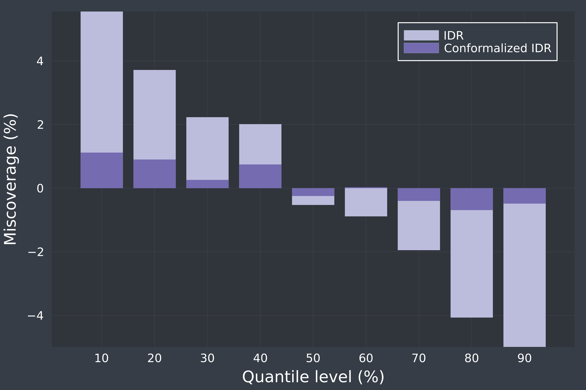

# Examples
Below you can find some simple examples of what can be achieved with **PostForecasts.jl**

## Load and postprocess point forecasts
In the first example, we show how to load point forecasts from a delimited file and postprocess them using a selected model in PostForecasts.jl. Assume that the file named `myforecasts.csv` has the following structure: 
```csv
time    real    predA   predB
1       110.8   118.7   116.0
2       18.0    114.1   109.2
3       71.9    82.7    75.0
...
```
To load and postprocess it, we only need two function calls:
```julia
using PostForecasts
pf = loaddlm("myforecasts.csv", delim='\t', idcol=1, obscol=2, predcol = [3, 4], colnames=true)
```
First, we read the file with the `loaddlm` function, which arguments specify that the file is tab delimited, the identifiers are stored in the first column, the observations in the second, and the predictions in the third and fourth. The last argument informs that the column names are present in the file, so the first row is not parsed into numeric values.
```julia
qf = point2quant(pf, method=:qr, window=100, quantiles=[0.5, 0.9])
```
Next, the `point2quant` function postprocesses the forecasts stored in `pf`, computes quantile predictions and returns a `QuantForecasts` object, saved to `qf`. In the above snippet, the arguments of `point2quant` specify that quantile regression is used for postprocessing, the length of the calibration window is 100 data points, and that we want to predict the median and the 90th percentile. By default, the postprocessing model is retrained before every prediction using a calibration window of most recent data points. For details on alternative configurations, see the documentation of the [`point2quant`](postprocess.md#From-point-to-probabilistic-forecasts) function.

Quantile forecasts `qf` are now ready to be [evaluated](evaluation.md#Evaluation-metrics), [averaged](averaging.md#Forecast-Averaging) with other forecasts, [conformalized](postprocess.md#Conformalizing-probabilistic-forecasts), and [saved](loadsave.md#Loading-and-saving-forecasts).

## Probabilistic forecasting of day-ahead electricity prices
In this example we show how to compute probabilistic forecasts of day-ahead electricity prices from point forecasts stored in the [EPEX dataset](datasets.md#EPEX) for all hours of the year 2023, using three different postprocessing schemes -- IDR, CP and QRA. See [(Lipiecki et al., 2024)](https://doi.org/10.1016/j.eneco.2024.107934) for more details on this forecasting task.

The code snippet below first creates a dictionary `qf` that for each key (corresponding to the postprocessing method) will store a vector of 24 `QuantForecasts` objects. Then it iterates over the 24 hours of the day, loads the point forecasts and, using each method, generates the probabilistic forecasts of 9 deciles (i.e. 10%, 20%, ..., 90% percentiles) for 2023:
```julia
using PostForecasts

methods = [:idr, :cp, :qr]
qf = Dict((m => Vector{QuantForecasts}(undef, 24) for m in methods)...)

for h in 1:24
    pf = loaddata(Symbol(:epex, h))
    for m in methods
        qf[m][h] = point2quant(pf, method=m, window=56, quantiles=9, start=20230101, stop=20231231)
    end
end
```
Probabilistic forecasts can then be combined, e.g., using vertical distribution averaging by calling `paverage`:
```julia
qf[:ave] = Vector{QuantForecasts}(undef, 24)
for h in 1:24
    qf[:ave][h] = paverage([qf[m][h] for m in methods])
end
```
and the CRPS of the individual and the combined predictive distributions can be easily compared:
```
println("Method \t| CRPS ")
println("-"^20)
for m in [methods..., :ave]
    println(uppercase(string(m)), " \t| CRPS: ", round(sum(crps.(qf[m]))/24, digits=3))
end
```
which should generate the following output:
```
Method 	| CRPS 
--------------------
IDR     | CRPS: 9.752
CP      | CRPS: 9.822
QR      | CRPS: 9.986
AVE     | CRPS: 9.248
```
Note that the computations can take some time. While IDR and CP are almost instantaneous, QR is more time-consuming and can take up to a few minutes.

The script corresponding to this example can be found in `examples/postprocess.jl`.

## Different flavors of quantile regression
There are multiple approaches to applying quantile regression to a pool of point forecasts, here we compare four of them, which can be readily computed using the **PostForecasts.jl** package.

The code below shows how to compute probabilistic forecasts of day-ahead electricity prices at 7pm for the entire 2021 from point forecasts stored in the [EPEX dataset](datasets.md#EPEX), using four variants of quantile regression and a one-year training window.

```
using PostForecasts

pf = loaddata(:epex20)
pf = pf(20200101, 20211231)
qf = Dict()
```

### QRA
**Q**uantile **R**egression **A**veraging - each point forecast is treated as a separate regressor in a multivariate quantile regression - $\hat{q}_{\tau|\hat{y}^{(1)}, ..., \hat{y}^{(m)}} = \beta^{(\tau)}_0 + \beta^{(\tau)}_1\hat{y}^{(1)} + ... + \beta^{(\tau)}_m\hat{y}^{(m)}$
```julia
qf["QRA"] = point2quant(pf, method=:qr, window=365, quantiles=9)
```

### QRM
**Q**uantile **R**egression **M**achine - point forecasts are averaged and treated as a single regressor in a univariate quantile regression - $\hat{q}_{\tau|\hat{y}^{(1)}, ..., \hat{y}^{(m)}} = \beta^{(\tau)}_0 + \beta^{(\tau)}_1 \frac{1}{m}\sum_{i=1}^m{\hat{y}^{(i)}}$
```julia
qf["QRM"] = point2quant(average(pf), method=:qr, window=365, quantiles=9)
```

### QRF
**Q**uantile **R**egression with probability (**F**) averaging - each point forecast is treated as a regressor of a univariate quantile regression, the output distributions of `m` quantile regressions are averaged over probabilities
```julia
qf["QRF"] = paverage(point2quant.(decouple(pf), method=:qr, window=365, quantiles=9))
```

### QRQ
**Q**uantile **R**egression with **Q**uantile averaging - each point forecast is treated as a regressor of a univariate quantile regression, the output distributions of `m` quantile regressions are averaged over quantiles
```julia
qf["QRQ"] = qaverage(point2quant.(decouple(pf), method=:qr, window=365, quantiles=9))
```

Then we can print the resulting CRPS of the computed forecasts:
```julia
println("Method \t| CRPS ")
println("-"^20)
for m in ["QRA", "QRM", "QRF", "QRQ"]
    println(m, "\t| ", round(crps(qf[m]), digits=3))
end
```
which should generate the following output:
```
Method 	| CRPS 
--------------------
QRA 	| 10.464
QRM 	| 10.229
QRF 	| 10.308
QRQ 	| 10.285
```
The script corresponding to this example can be found in `examples/quantregs.jl`.

## Conformalizing weather forecasts
In this example we show how to conformalize quantile forecasts to improve the coverage of predictive distributions of weather variables from the [PANGU dataset](datasets.md#PANGU) postprocessed using IDR, and visualize the miscoverage, i.e., the difference between nominal and empirical coverage, with respect to the quantile levels.

We will first load the dataset (select the target variable and the lead time of point predictions):
```julia
using PostForecasts

variable = :u10 # u10, c10, t2m, t850 or z500
leadtime = 24 # between 0 and 186, divisible by 6

pf = loaddata(Symbol(:pangu, leadtime, variable))
```
Then, using the `point2quant` function, we compute the quantile forecasts `qf` for 9 deciles using IDR with a training window of 365 days and calculate its miscoverage with the help of the `coverage` function:
```julia
qf = point2quant(pf, method=:idr, window=364, quantiles=9)
miscoverageIDR = (coverage(qf) - getprob(qf)).*100
```
Now, we can conformalize forecasts stored in `qf` and calculate the miscoverage of conformalized quantiles:
```julia
conformalize!(qf, window=182)
miscoverageConformalizedIDR = (coverage(qf) - getprob(qf)).*100
```
Note that we used the in-place method `conformalize!`, which will leave the first 182 unconformalized predictions in `qf`, ensuring that the we compare the results on the same time period.

Finally, we generate a barplot representing the miscoverage for every forecasted quantile level:
```julia
using Plots
plot(xlabel="Quantile level (%)", ylabel="Miscoverage (%)", framestyle=:grid, xticks = 10:10:90)

qf = point2quant(pf, method=:idr, window=365, quantiles=9)
bar!(getprob(qf).*100, (coverage(qf)-getprob(qf)).*100, linewidth=0, color=colorant"#bcbddc", label="IDR") 

conformalize!(qf, window=182)
bar!(getprob(qf).*100, (coverage(qf)-getprob(qf)).*100, linewidth=0, color=colorant"#756bb1", label="Conformalized IDR")
```
The resulting plots shows that the conformalization helped to significantly decrease the miscoverage of IDR predictions, leading to better calibrated quantile forecasts, especially at extreme levels (0.1 and 0.9):


The script corresponding to this example can be found in `examples/conformalize.jl`.

## Supporting decision making on energy markets
To highlight the significance and utility of probabilistic forecasts, let us present a short scenario of trading on day-ahead electricity market.

Consider an energy company that owns a battery and trades in the day-ahead market. Every morning it faces the decision about whether to submit a buy order to charge the battery and a sell order to discharge it at a later hour of the next day, or avoid trading due to adverse market conditions. In this example, we show how probabilistic forecasts can help us identify risky market conditions and prevent losses.

For simplicity, we focus on two weeks in April 2023 and assume that buy orders are submitted at 3am while sell orders at 7pm. The following snippet shows how to postprocess point predictions from the EPEX dataset to obtain decile forecasts using the IDR:
```julia
using PostForecasts

pfbuy = loaddata(Symbol(:epex, 4))      # point forecasts for 3am
pfsell = loaddata(Symbol(:epex, 20))    # point forecasts for 7pm

qfbuy = point2quant(pfbuy, method=:idr, window=182, quantiles=9, start=20230408, stop=20230421)
qfsell = point2quant(pfsell, method=:idr, window=182, quantiles=9, start=20230408, stop=20230421)
```
From the decile forecasts we can construct four prediction intervals (PI) centered around the median, i.e., the 5th decile, with confidence levels of 20%, 40%, 60% and 80%. For example, the 20%-PI is obtained by taking the 4th and the 6th deciles, while the 80%-PI by taking the 1st and the 9th. To visualize the results, we can plot the median price forecasts, the PIs and the observed prices at 3am and 7pm (helper functions for plotting are available in `src/examples/plotting.jl`):
```julia
# load plot_obs!, plot_quantile! and plot_intervals!
include(joinpath("src", "examples", "plotting.jl"))

pfbuy = loaddata(Symbol(:epex, 4))      # point forecasts for 3am
pfsell = loaddata(Symbol(:epex, 20))    # point forecasts for 7pm

qfbuy = point2quant(pfbuy, method=:idr, window=182, quantiles=9, start=20230408, stop=20230421)
qfsell = point2quant(pfsell, method=:idr, window=182, quantiles=9, start=20230408, stop=20230421)

plt = plot(legend=:bottom, xlabel="Days", ylabel="Price (EUR/MWh)", xticks=1:14, framestyle=:box) 
plot_intervals!(plt, qfsell, color=1)
plot_intervals!(plt, qfbuy, color=3)
plot_quantile!(plt, qfsell, 5, color=1)
plot_quantile!(plt, qfbuy, 5, color=3)
plot_obs!(plt, qfsell, color=1, label="Sell price")
plot_obs!(plt, qfbuy, color=3, label="Buy price")
```


Clearly, on the third day the upper quantiles of prices for 3am significantly overlap the lower quantiles of prices for 7pm. This indicates that the buy price is quite likely to be higher than the sell price, so the trading strategy carries substantial risk. Indeed, the actual price at 7pm ($\rightarrow$ red dot) was lower than at 3am ($\rightarrow$ green dot) for that day, so trading would lead to incurring a loss. 

This short example showcases how probabilistic forecasts can aid decision making with richer information about possible outcomes. To read about the strategies for battery-based trading on electricity markets and their economic evaluation, see the contributions of [Nitka and Weron (2023)](https://doi.org/10.48550/arXiv.2308.15443) and [Maciejowska et al. (2023)](https://doi.org/10.48550/arXiv.2303.08565).

The script corresponding to this example can be found in `examples/trading.jl`.
